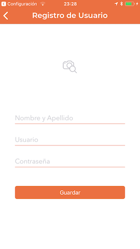
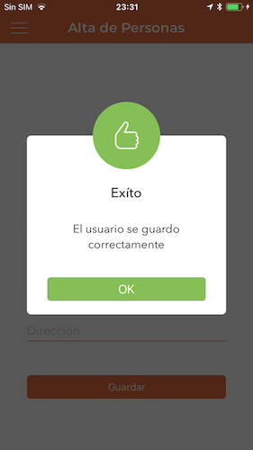
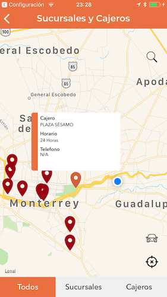
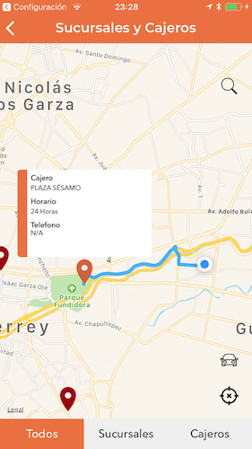
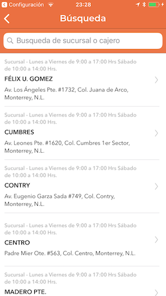
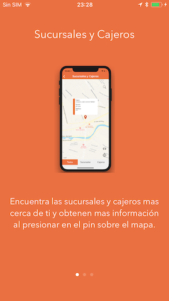
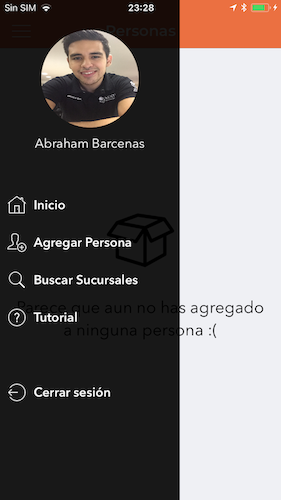
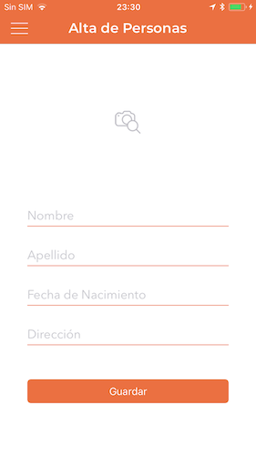
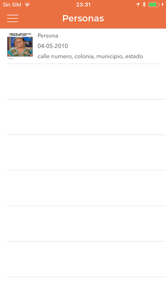

# Banregio Example

Banregio Example is a project created for practicing and improving my skills.

Banregio Example app is an application that uses a public api provided by Banregio bank in mexico, that returns a json with the locations and descriptions of some of the banks branches and atms in mexico.
In this app you can find some of the locations of the bank branches in a map and make a route from your position to the location, you can also create an account and add people to the local database of your phone using coreData.

This project uses:

* Auto Layout
* Stack Views
* Table Views
* Container Views
* Custom Alerts
* SearchController
* Animations
* Segues
* Clases
* Custom Clases
* Object oriented programming
* Closures
* URLRequest for Api Consumption
* Escaping Closures
* Delegates
* Protocols
* NotificationCenter
* CoreData
* MapKit
* Custom Annotations
* Map Routes
* PageViewController for Tutorial
* ImagePickerController for camara and photo library usage
* How to create a left main menu

